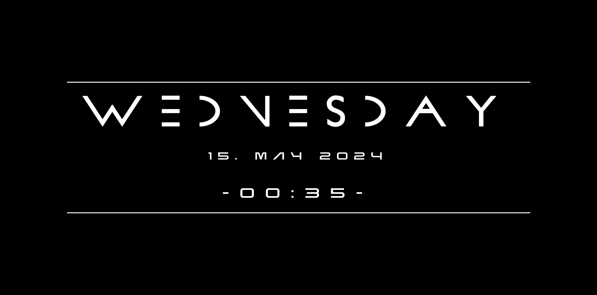
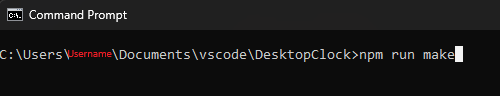
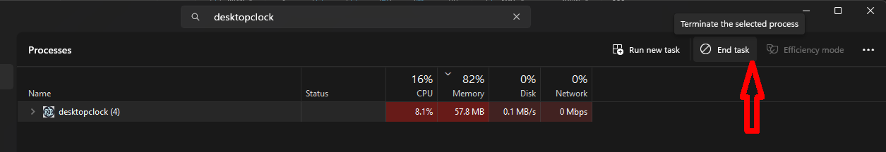
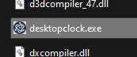

# DesktopClock

This is a small app, that places a kind of clock on your desktop, like e.g. SimpleClock. Admittedly it doesn't have as much features, but with a little HTML / CSS it's possible to create custom designs.

## Install

1. Build DesktopClock with <code>npm run make</code> in the DesktopClock directory via cmd.

2. Copy the <code>public/</code> folder into <code>./out/desktopclock-win32-x64/</code>.

3. Stop app via TaskManager.

4. Putting a link to the exe into the <code>C:\Users\\\{Username}\AppData\Roaming\Microsoft\Windows\Start Menu\Programs\Startup</code> will cause it to start automatically, after login, for the specified user. (Optional)

   1. * Copy file.

   2. Go to <code>C:\Users\\\{Username}\AppData\Roaming\Microsoft\Windows\Start Menu\Programs\Startup</code>.

   3.
        Right-click on an empty spot. 
        Evt. on Windows 11 click on _Show more options_.
        Click on _Paste shortcut_.

5. The folder <code>desktopclock-win32-x64/</code> can now be moved to a more favourable location at wish. 

## Usage 

DesktopClock lacks all functionality. Closing it works, by right-click on the app icon in the tray.

## Note

Font's have to be set manually. The preview image uses _PROMETHEUS_ for the name of the day and _NEBULA_ for the rest.

- By default, the font is set to Arial.

- Name of weekday font must be called: <code>weeday.ttf</code>
- Font for the rest must be called <code>date-time.ttf</code>

    * Though this can easily be changed in the _clock.html_.

### Disclaimer

_Only tested on Windows 11 with the following specs:_

* npm: '10.2.4',
* node: '21.5.0',

---

_Written and not maintained by ScorpioBlood._